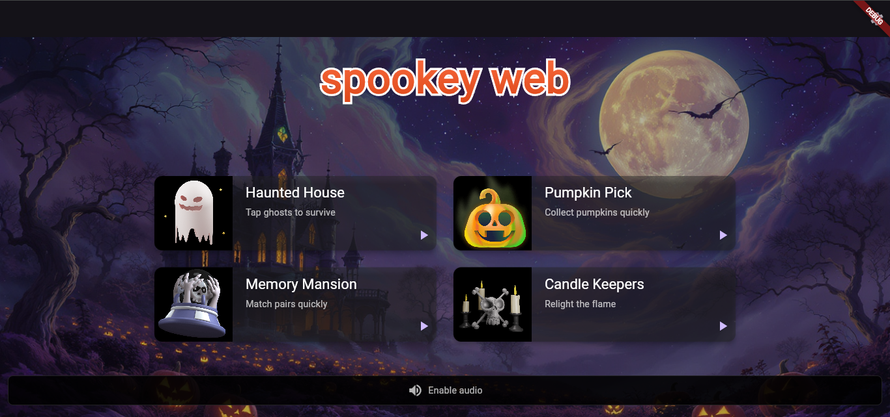
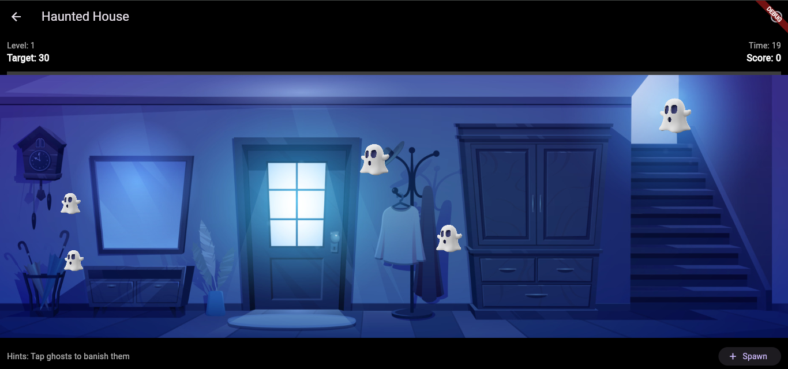
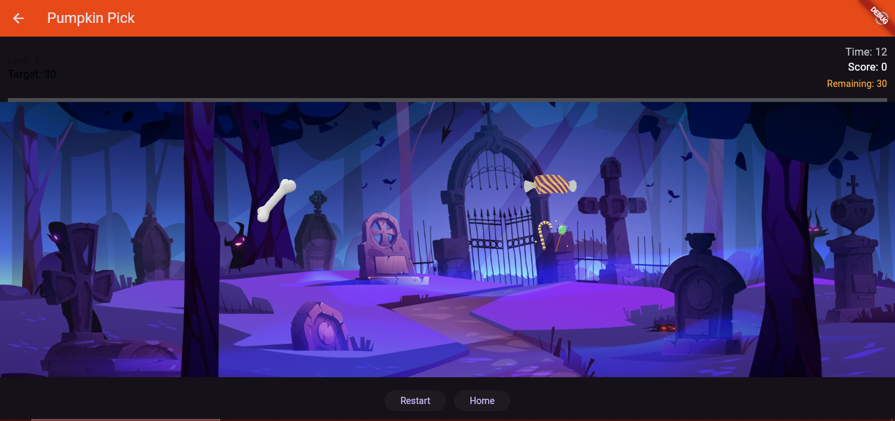

Spookey Web is a Halloween-themed mini-game collection built with Flutter. It includes multiple short arcade-style mini-games, background music, sound effects, and a responsive UI targeting Web and mobile.

- Global sound controls (mute + volume)
- Responsive layouts for web and mobile

Screenshots
Screenshots are given below:
Home / main screen


Haunted House (mission 1)


Pumpkin Pick (mission 2)


Memory Mansion (mission 3)


Candle Keepers (mission 4)


Features
- Multiple mini-games (Haunted, Pumpkin Picker, Memory Mansion, Candle Keepers)
- Per-screen background music and short SFX


Getting started

Prerequisites
- Flutter SDK (stable channel)

Run locally (web)

```powershell
flutter pub get
flutter run -d chrome
```

Build for web

```powershell
flutter build web --release
```

Notes and troubleshooting
- If audio doesn't start automatically on web, open the Settings on the home screen and toggle sound or click the "Enable audio" banner to grant audio playback permission.
- Do NOT commit secrets or API tokens in source files. If you found a leaked token in this repo, rotate/revoke it immediately.

Contributing
- See `CONTRIBUTING.md` for contribution guidelines and CI details.

License
- This project is released under the MIT License. See `LICENSE`.
'@ > README.md"